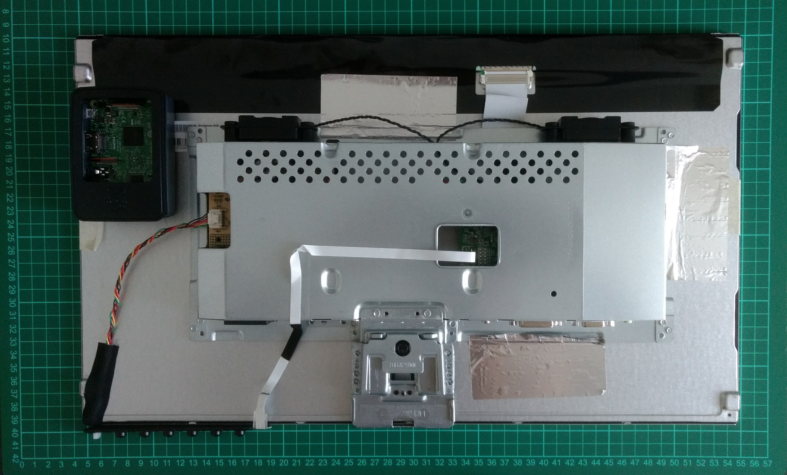

# Project Grimhilde


## Instructions

### Raspberry Pi 3 system

Default installation of of [Raspbian Jessie with PIXEL](https://www.raspberrypi.org/downloads/raspbian/). You can also follow the [official instructions for Jessie Lite](https://github.com/MichMich/MagicMirror/wiki/Jessie-Lite-Installation-Guide).

Once Raspbian is up and running:
1. `apt-get update` and `apt-get upgrade`.
2. Change hostname to `grimhilde`.
3. Change default password.
4. Enable SSH.
5. Enable VNC, so that you can connect using [VNC Connect](https://www.realvnc.com/download/vnc/).

### MagicMirror software

Install [MagicMirror²](https://github.com/MichMich/MagicMirror):

```bash
> bash -c "$(curl -sL https://raw.githubusercontent.com/MichMich/MagicMirror/master/installers/raspberry.sh)"
```

Follow all the steps in MagicMirror²'s [Configuring the Raspberry Pi](https://github.com/MichMich/MagicMirror/wiki/Configuring-the-Raspberry-Pi) and [Auto Starting MagicMirror](https://github.com/MichMich/MagicMirror/wiki/Auto-Starting-MagicMirror).

## External documentation

### Original project
- [Magic Mirror: Part I - The Idea & The Mirror](http://michaelteeuw.nl/post/80391333672/magic-mirror-part-i-the-idea-the-mirror)
- [Magic Mirror: Part II - The Monitor](http://michaelteeuw.nl/post/81059936176/magic-mirror-part-ii-the-monitor)
- [Magic Mirror: Part III - The Casing](http://michaelteeuw.nl/post/81784924322/magic-mirror-part-iii-the-casing)
- [Magic Mirror: Part IV - Install The Hardware](http://michaelteeuw.nl/post/82565319113/magic-mirror-part-iv-install-the-hardware)
- [Magic Mirror: Part V - Installing the Raspberry Pi](http://michaelteeuw.nl/post/83188136918/magic-mirror-part-v-installing-the-raspberry-pi)
- [Magic Mirror: Part VI - Production of the Interface](http://michaelteeuw.nl/post/83916869600/magic-mirror-part-vi-production-of-the)

### Examples

- https://forum.magicmirror.builders/topic/1678/1-old-noob-1-rpi-i-can-t-believe-i-did-it-revisited
- https://forum.magicmirror.builders/topic/2293/27-custom-framed-magic-mirror-fun-to-get-done/2

## Inventory

| Item | Model | Price (EUR) |
|------|-------|-------:|
| CPU | Raspberry Pi 3 B + case + power + SD card | 68,00 |
| Monitor | BenQ GW2270HM | 109,00 |
| Glass | [PyraSied Primo](https://www.pyrasied.nl/product/doorkijkspiegel/) 495x292 mm | 41,53 |
| Sound card | Creative Sound Blaster Play! 2 | 22,94 |
| Microphone | König Clip-on Microphone | 7,15 |
| Webcam | Raspberry Pi Camera Module V2 | 29,95 |
| Cable | Veripart HDMI 0,5 m | 9,99 |
| Cable | 3,5mm jack 0,5 m | 5,45 |
| | **Total** | **294,01** |

## Panel measurements

### Top


### Bottom


## Images

### Panel top


